# Control DER using AWS IoT

This code is part of a Blogpost which you can find [here](https://aws.amazon.com/blogs/industries/how-to-control-distributed-energy-resources-using-aws-iot/). Please have a read the blog before exploring the example to better understand the problem and the architecture we are going to deploy.

## Solution architecture

Here you can find the architecture which is built in this project. Please refer to the blogpost for the detailed description and explanation.

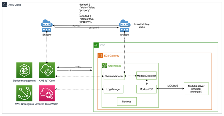

## Prerequisites

The code is based on the [AWS Cloud Development Kit (CDK)](https://aws.amazon.com/cdk/) which is defining the required infrastructure using typescript. Running the code will deploy all the components shown in the architecture above. You will be able to clean-up the environment any time simply by running the provided clean-up script.
Running this example in your AWS Environment will incurr you infrastructure costs, to reduce it please clean-up the environment as soon as you have done testing.

The example has the following prerequisites:
1. The provided scripts are compatible with: Amazon Linux, Amazon Linux 2, Linux Mint, Debian 10 and 11, Ubuntu 20 to 22.1, RHEL 8, CentOS 8, Fedora 33 to 36
    * If you are on a windows machine or any other unsupported OS we suggest to use an [AWS Cloud9](https://aws.amazon.com/cloud9/) environment directly from your AWS Account

2. An AWS account. To sign up:
    * Create an account. For instructions, see [Sign Up For AWS](https://lakeformation.aworkshop.io/30-prerequisite/301-sign-up-aws.html).
    * Create an [AWS Identity and Access Management (IAM)](http://aws.amazon.com/iam) user. For instructions, see [Create IAM User](https://lakeformation.aworkshop.io/30-prerequisite/302-create-iam-account.html).
3. The following software must be installed on your development machine:
    *Java Development Kit 11 or higher (i.e., [Amazon Corretto 11](https://docs.aws.amazon.com/corretto/index.html), [OpenJDK 11](https://openjdk.java.net/projects/jdk/11/))
     * Zip and Unzip
     * [Git](https://git-scm.com/) version 2 or higher
     * [Python](https://www.python.org/) version 3.7 or higher
     * [AWS CLI](https://docs.aws.amazon.com/cli/latest/userguide/cli-chap-install.html) 2.4.27 or higher
     * [NodeJS](https://github.com/nodesource/distributions) 18.0.0, 16.3.0 or 19.0.0
     * [AWS CDK](https://docs.aws.amazon.com/cdk/v2/guide/cli.html) 2.28.1 or higher
     * [JQ](https://stedolan.github.io/jq/) 1.5 or higher
4. Ensure that you have appropriate [AWS credentials](https://docs.aws.amazon.com/cli/latest/userguide/cli-configure-files.html) for interacting with resources in your AWS account


### Initial setup

1.	Clone the project GitHub repository
```bash
git clone https://github.com/aws-samples/control-der-aws-iot
```
2.	Navigate into the `der-control-aws-iot/script` folder
```bash
cd der-control-aws-iot/script
```
3. Set owner as non-root and give owner execute permissions for all scripts
```bash
sudo chmod u+x *.sh
```
4.	Navigate into the `der-control-aws-iot/binaries` folder
```bash
cd ../binaries
```
5.	Download the Modbus simulator
```bash
wget https://www.modbusdriver.com/downloads/diagslave.tgz
```
6.	Navigate to `der-control-aws-iot/codes/component/aws.greengrass.labs.ModbusTCP/src` folder
```
cd ../codes/component/aws.greengrass.labs.ModbusTCP/src
```
7.	Download the Modbus TCP Greengrass module 
```bash
wget https://github.com/awslabs/aws-greengrass-labs-modbus-tcp-protocol-adapter/releases/download/v1.0.0/ModbusTCP-1.0.0.jar
```
8.	Navigate into the `der-control-aws-iot`
```bash
cd ../../../../
```
9.	Edit the configuration adding the AccountID and Region of your account
-	Open the file `./config/app-config-demo.json` using a text editor
-	Replace `<put-your-accountID-here>` with your [AWS account ID](https://docs.aws.amazon.com/signin/latest/userguide/FindingYourAWSId.html)
-	Replace `<put-your-region-here>` with your region i.e., `eu-central-1`
-	Replace `<put-your-email-here>` with the email where you want to receive the notification into
10.	Export the configuration
```bash
export APP_CONFIG=./config/app-config-demo.json
```
11.	Run the CDK setup script to initialize CDK on the account
```bash
./script/setup-initial.sh
```
12.	Package the Greengrass modules
```bash
./script/pack-components.sh
```
13.	Deploy the whole solution, note that it will take several minutes (between 15 and 20)
```bash
./script/deploy-full-stack.sh
```

### Deployment checks
1. Navigate to the AWS Console inside the EC2 service in the target region, you will find one new EC2 running called `derms-ggv2-thermostat`
2.	Click on the `derms-ggv2-thermostat` EC2 checkbox and click `Connect`
3.	Move to the Session Manager tab and press `Connect` again. If the button is greyed out, please wait one minutes and try again.
4.	Once the SSH session is open run this command to check that the Modbus simulator is running and has accepted the connection from the Modbus Greengrass component. You can also notice that the edge logic is already reading the temperature registries
```bash
less /tmp/simulator-log.txt
```

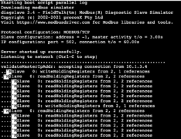

5.	Go back to the AWS Console and Navigate to Amazon CloudWatch by searching it in the top bar
6.	Click on “Log groups”, and search for the log group for the ModbusController component and click to navigate inside it

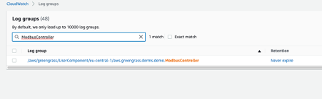
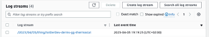

7.	Check that the component is correctly logging events

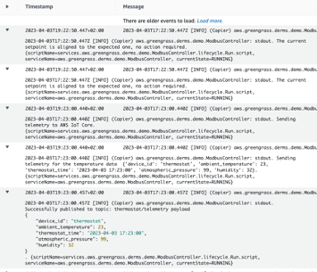

8.	Finally check the email inbox that you provided in the configuration to find a Subscription Configuration email. To receive the notification from the solution click on the Confirm Subscription link present in the email.

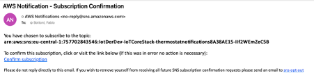

### Telemetry and state reporting
1.	Thermostat is now reading the temperature setpoint and the external temperature from the MODBUS controller. The setpoint will be reported in the shadow while the external temperature will be sent over MQTT as telemetry.
2.	To read the telemetry you can navigate to the AWS IoT Core by searching for `IoT Core` in the top bar
3.  Under Test click on MQTT test client
4.	Input `thermostat/telemetry` inside the Topic filter input box and click Subscribe to start receive the readings. Greengrass is sending a reading every 10 seconds.

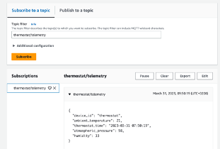

4.	To read the reported thermostat setpoint in the shadow, navigate to `All devices` and click `Things`. In the list click on `IotDerDev-derms-gg-thermostat`
5.	Once in the detail page click on the `Device Shadows` tab and on `Classic Shadow`

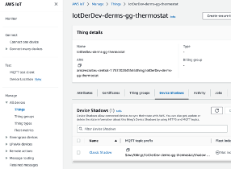

6.	Here you can see the status of the thermostat setpoint. A fictional user is changing the setpoint manually every minute so you can see the target_temperature changing randomly every minute

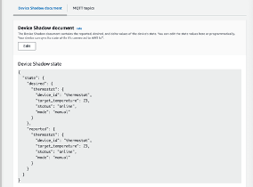

7.	Let’s simulate a dispatch event. To do it we will change the thermostat status from “manual” to “auto” and imposing a target temperature using the desired state. Applications can do it by calling an AWS IoT API or using MQTT topics. In this example we do it manually by editing the Device Shadow document clicking on Edit from the console. This change will impose a new automatic temperature to the thermostat using AWS IoT Shadows.
8.	Note that the remote change we are about to trigger will be reverted within a minute by the local fictional user. We can monitor this behavior from the shadow thanks AWS IoT Greengrass synchronizing manual changes reporting them in the cloud.
9.	To test this just click on Edit and change the values of “mode” to “auto” and “target_temperature” to “15” in the Desired state to see how the Reported state will align immediately. Within a minute it will revert back to manual due to the fake manual change detected and reported by AWS IoT Greengrass

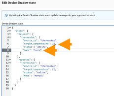

10.	The reported change of state is monitored by an AWS IoT rule which is responsible to trigger an email notification. You can verify the triggered rule by checking if you have received the notification in the email stating the exit from the program

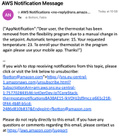

11.	You can perform this action many times with different values. If you want to dive deeper on what is happening on the AWS IoT Greengrass component you can check the Amazon CloudWatch logs for the ModbusController component

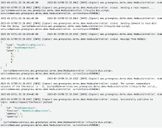

### Cleanup

1.	In order to clean-up all the created resources from your account you can run the cleanup script:
```bash
./script/clean-up.sh ./config/app-config-demo.json
```
